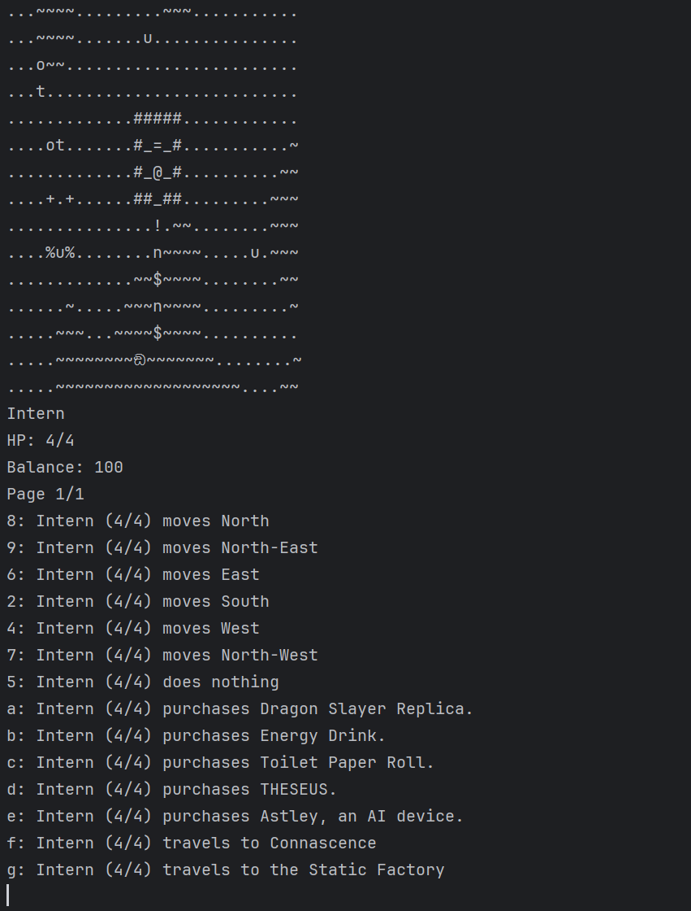

# Static Factory

A text-based roguelike game developed collaboratively by a 4-person team, adhering to **Object-Oriented Programming principles** and **Design Patterns** to create a modular and easily extensible game.

## Development Process

The game was developed in **3 stages**, with each stage adding 4 new requirements/features to the game. Each requirement of a stage was taken on by a different team member, allowing us to work in parallel and integrate our work at the end of each stage. 

### Design Methodology
- **Requirements Analysis**: Each new requirement was discussed and agreed upon by the team
- **UML Class Diagrams**: Created to visualise the design of new features before implementation
- **Modular Implementation**: UML diagrams guided development to ensure modular and extensible code
- **Design Documentation**: Comprehensive design rationale documenting alternative designs and reasoning behind decisions in terms of adherence to **SOLID principles**
- **Sequence Diagrams**: Created for stages 2 and 3, detailing object interactions during specific use cases to aid understanding of game flow

## Game Overview
Static Factory takes place in a setting inspired by the game Lethal Company. The player plays as the Intern hired by a factory,
whose objective is to collect scraps on the abandoned moon of "Polymorphia".

### Game Mechanics
- **Starting Stats**: 4 base HP, 100 credits in balance
- **Controls**: Number keys for movement, letter keys for interactions
- **Turn-based**: Each turn represents a new action
- **Game Over**: When the Intern's HP reaches 0

The Intern (`@`) starts inside their spaceship with various scraps scattered outside, including large bolts (`+`) and metal sheets (`%`). 

### Enemies
The Intern must be careful, as they are not alone on the moon. Enemies emerge from craters (`u`) around the map:
- **Huntsman Spiders (`8`):** Each crater spawns this creature with a 5% chance at every game turn. They will attack the Intern if they are within 1 tile of them, dealing an attack of 1 HP with 25% accuracy. Huntsman Spiders have 1 HP and cannot enter the spaceship.
- **Alien Bug (`a`):** Each crater spawns this creature with a 10% chance at every game turn. Each Alien Bug is named "Feature-XXX", where XXX is three random digits. Instead of attacking the Intern, Alien Bugs will steal any scraps it is standing on.
This includes scraps inside the spaceship, which the Alien Bug can enter. If an Alien Bug comes within 1 tile of the Intern, it starts following the Intern. To stop the Alien Bug from following and to retrieve the scraps it has stolen, the Intern must defeat it. Upon defeat, the Alien Bug will drop all stolen scraps. Alien Bugs have 2 HP. 
- **Suspicious Astronaut (`ඞ`):** Each crater spawns this creature with a 5% chance at every game turn. The Suspicious Astronaut will attack the Intern if they are within 1 tile of them, instantly killing them with 100% accuracy. Suspicious Astronauts have 99 HP
and cannot enter the spaceship.

### Combat & Special Items
In order to fight back against enemies, the Intern can choose to punch enemies directly next to them, dealing 1 HP of damage with
5% accuracy. The Intern can also make use of the following special scraps found in the map to aid them:
- **Metal pipe (`!`):** Found directly outside the spaceship, this scrap can be used to attack enemies once picked up. The Intern can use the metal pipe to attack enemies directly next to them, dealing 1 HP of damage with 20% accuracy.
- **Fruits (`o`/`O`):** Scattered around the map are "Inheritree" plants. They start off as saplings (`t`), producing small fruits (`o`), next to them with a 30% chance at every game turn. After 5 turns, the plant grows into its mature form (T). It can now produce large fruits (`O`) with a 20% chance at every game turn. The player can pick up fruits and consume them. Small fruits restore 1 HP, while large fruits restore 2 HP. 
- **Jar of Pickles (`n`):** 50% chance of either hurting the Intern for 1 HP or restoring 1 HP when consumed.
- **Pot of Gold (`$`):** Consuming it increases the Intern's balance by 10.
- **Puddle of Water (`~`):** Standing on puddles of water in the map, will allow the Intern to consume from it without picking
it up. This permanently increases the Intern's maximum HP by 1.

### Computer Terminal
By using the computer terminal (`=`) inside the spaceship, the Intern can:
#### Purchase Items

- **Energy Drink (`*`):** Costs 10 credits. Restores 1 HP when consumed. When purchasing it from the computer terminal, there is
a 20% chance that the terminal asks for double the price.
- **Dragon Slayer Replica (`x`):** Costs 100 credits. A powerful weapon that deals 50 HP of damage with 75% accuracy. There is a 50%
chance that an error occurs when purchasing it, causing the terminal to take the credits but not give the item.
- **Toilet Paper Roll (`s`):** Costs 5 credits. It does literally nothing. There is a 75% chance that the terminal only asks for 1
credit when purchasing it instead of the full price. 
- **THESEUS (`^`):** Costs 100 credits. Dropping THESEUS on the ground will give the Intern the option to teleport with it, which
tranpronts the Intern to a random tile in the current map.
- **Astley(`z`):** Costs 50 credits. An AI device whose monologues the Intern can listen to. Astley comes with a subscription fee of 1 credit every 5 turns. If the Intern does not have the credits to pay the subscription fee, Astley will stop working until the Intern has enough credits to pay the fee.

#### Travel to Other Maps
The Intern can travel to
the **Static Factory**, where they can find a humanoid figure (`H`). The Intern call sell collected scraps to the figure:
| Scrap Item | Base Price | Special Conditions |
|------------|------------|-------------------|
| **Large Bolt** (`+`) | 25 credits | Standard price |
| **Metal Sheet** (`%`) | 20 credits | 60% chance of 10 credit discount |
| **Large Fruit** (`O`) | 30 credits | Standard price |
| **Jar of Pickles** (`n`) | 25 credits | 50% chance of double payment (50 credits) |
| **Metal Pipe** (`!`) | 35 credits | Standard price |
| **Pot of Gold** (`$`) | 500 credits | 25% chance factory takes without payment |
| **Toilet Paper Roll** (`s`) | 1 credit | 50% chance humanoid kills Intern |

Alternatively, the Intern can use the computer terminal to travel to **Connascence**. Like Polymorphia, this moon features Inheritree plants, but with a more complex growth cycle. On Connascence, Inheritrees begin their life as sprouts (`,`), which remain barren for 3 turns before developing into saplings (`t`). These saplings maintain their fruit-producing capabilities from the previous moon, generating small fruits (`o`) with a 30% chance each turn.

After 6 turns, saplings evolve into young Inheritrees (`y`), entering a dormant phase where fruit production ceases entirely. Following an additional 5-turn maturation period, these young trees reach full maturity (T), resuming their ability to produce large fruits (`O`) with a 20% chance per turn, matching the behavior of mature Inheritrees found on Polymorphia.

# Setup
1. **Clone the repository**
2. **Run** `src/Game/Application.java` to start the game
3. **Controls**: Type and enter number and letter keys associated with actions as displayed in the interface
